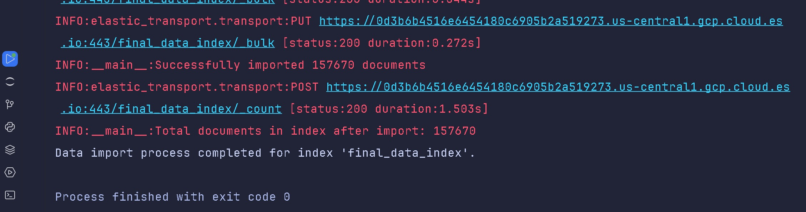
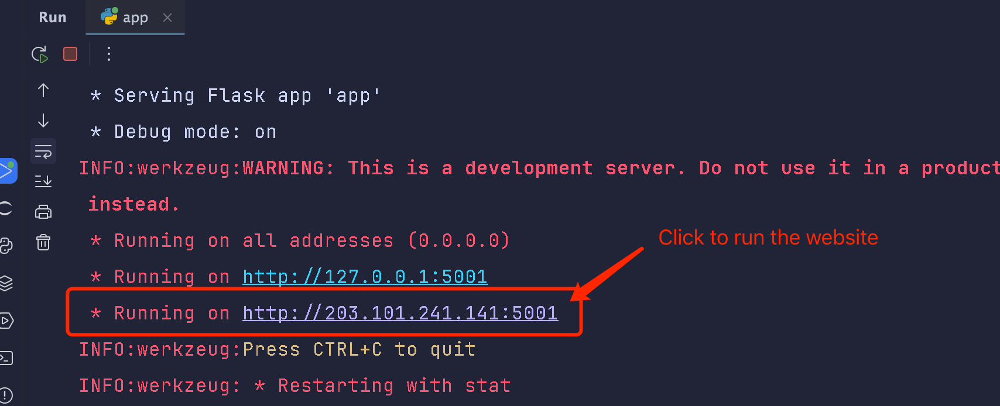
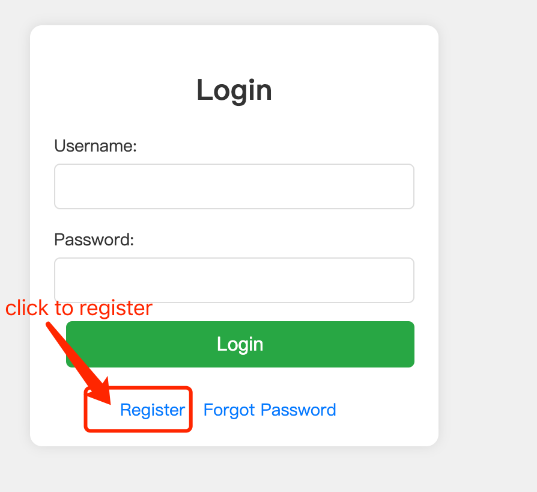
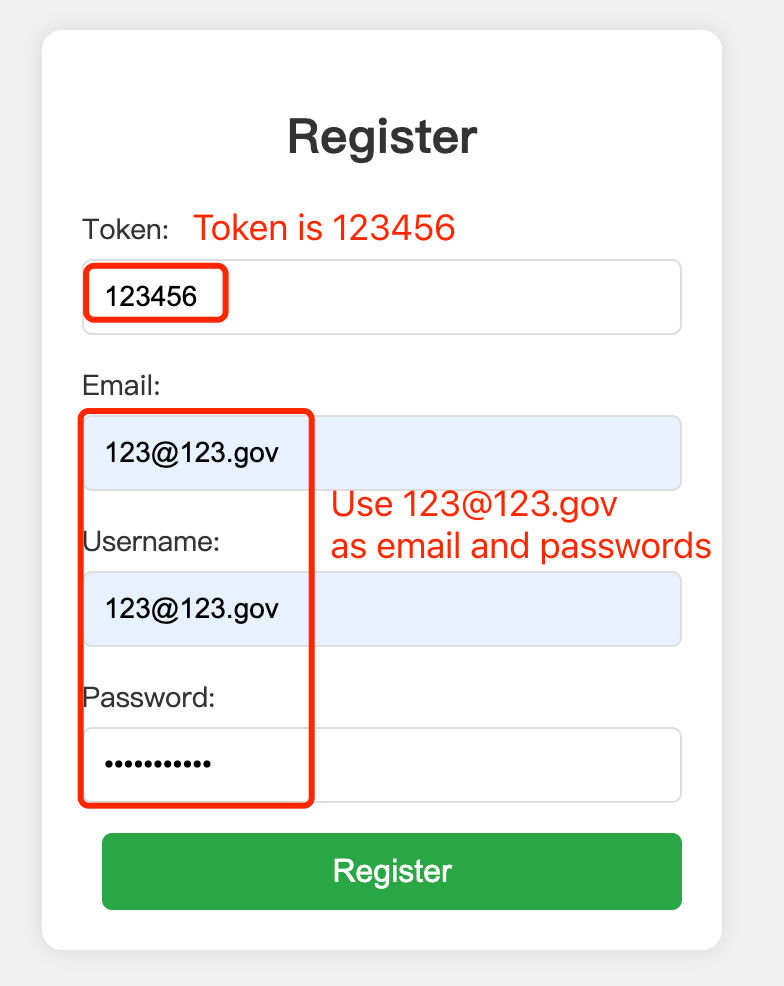
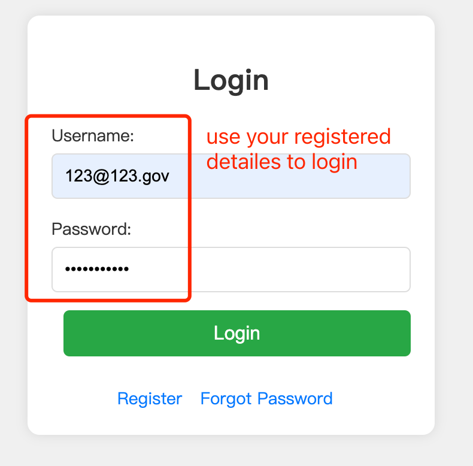
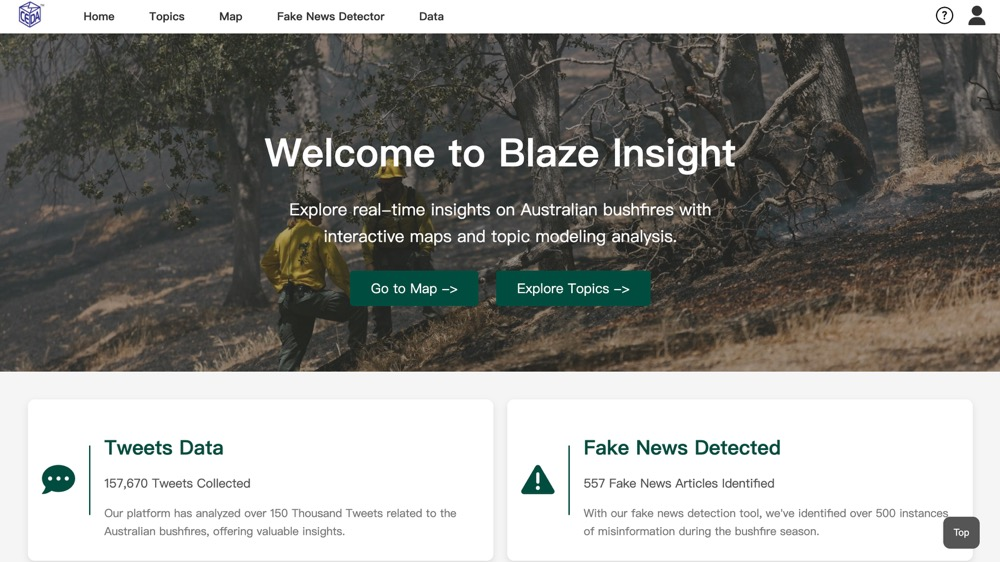

# DECO3801 Project 50T: Analyzing Misinformation on Twitter During the 2019-20 Australian Bushfires

## 1. Project Overview

### 1.1 Project Description
The 2019-20 Australian bushfires highlighted the vital role of social media platforms, particularly Twitter, in the dissemination of information and the expression of public sentiment. However, these platforms also became conduits for fake news and misinformation, which had the potential to exacerbate public anxiety and spread false narratives. This project is dedicated to analyzing nearly 500,000 tweets from this period to uncover genuine public reactions, identify key discussion topics, and assess the impact of misinformation.

Based on background research, the platform is specifically designed for media professionals, policymakers, and researchers who are keen to understand the public's response during this crisis. It focuses on identifying potential patterns of fake or misleading information by evaluating the credibility of shared content through methods such as detecting extreme sentiment scores, analyzing account statuses, and implementing fake news detection techniques. The findings will be presented via an interactive visual platform, enabling users to dynamically explore the data, grasp public sentiment, and recognize the role of misinformation during the bushfires. Ultimately, the platform aims to enhance users' understanding of public reactions during crises, inform media coverage and policy decisions, and strengthen the ability of researchers to critically evaluate misinformation.

### 1.2 Project Intent
This project endeavors to construct a rigorous analytical framework that bridges the gap between complex data analysis and the critical needs of media professionals, policymakers, and academic researchers. Through the visualization of emotional responses and the application of advanced methodologies for detecting misinformation, the platform will facilitate a nuanced understanding of the dynamics of public sentiment and the dissemination of false information during the bushfires. The goal of this project is to render sophisticated analytical insights accessible to these expert audiences, thereby enhancing their ability to critically assess the role of misinformation in shaping public discourse during crises.

## 2. Getting Started

### 2.1 Clone the Repository

    git clone https://github.com/Joezhou1211/DECO3801_T50

### 2.2 Navigate to Project Directory

    cd DECO3801_T50

### 2.3 Create and Activate Virtual Environment

Windows run: 

    .\setup_virtual_env.ps1
Mac Run:  
  
    chmod +x
    setup_virtual_env.sh ./setup_virtual_env.sh

### 2.4 Install Dependencies

    pip install -r requirements.txt

Here are all the dependencies below:

    sentence-transformers==3.1.1
    dateparser==1.2.0
    elasticsearch==8.15.1
    flask
    flask-cors==5.0.0
    eventregistry==9.1
    requests==2.31.0
    numpy>=1.26.4,<2.0.3
    spacy==3.8.2
    thinc==8.3.2
    google-generativeai==0.8.3
    pandas
    
If any installations fail, manually install the required package like: pip install flask==2.2.2

### 2.5 Install SpaCy Model

    python -m spacy download en_core_web_sm

### 2.6 Read Data(Not necessary)

    cd backend
    python data_importer.py

After successfully running it, you should see the output below.



### 2.7 Run the Application

    cd backend
    python app.py

After successfully running the application, navigate to the second website.



## 3. Register and Login

### 3.1 Navigate to the Login Page

After running the application, you will see the login page as shown below. If you don’t have an account, click on the "Register" link to create a new account.



### 3.2 Register a New User

To register, enter the required token (which is 123456), your email, username, and password as shown in the image below. Use the same email address (123@123.gov) as both the email and username for this demo.



### 3.3 Login

Once registered, use the login page to sign in with your new credentials and begin using the application.



### 3.4 Using the Application

Once logged in, you will see the main dashboard of the application, where key insights and data visualizations are provided, including the number of total tweets, fake news tweets, and sentiment analysis.



## 4. Features and Technologies

### 4.1 Features
This project incorporates several key features to analyze and visualize the public sentiment and misinformation during the 2019-20 Australian bushfires. Sentiment analysis is implemented using VADER and TextBlob to assess the emotional tone of tweets. Topic modeling is conducted using Latent Dirichlet Allocation (LDA) to identify the main topics of discussion during the crisis. To detect fake news, we employ a range of machine learning models, including Logistic Regression, Random Forest, XGBoost, SVM, LSTM, and BERT. Finally, the project includes interactive data visualizations powered by ElasticSearch, enabling real-time data querying and filtering to provide users with a dynamic exploration of the tweet data.

### 4.2 Tools/Technologies/Frameworks
The project leverages a variety of tools and technologies across different stages of data processing, analysis, and visualization. Data processing is handled using Pandas, NLTK, TextBlob, and VADER, while natural language processing (NLP) and machine learning tasks are performed using TF-IDF, Word2Vec, BERT, Scikit-learn, TensorFlow, and Keras. For data visualization, the project utilizes D3.js, Chart.js, Plotly.js, Leaflet, and Mapbox. UX design is informed by research through Google Scholar and user interviews, with UI design executed using Sketch, Miro, and Figma. The backend infrastructure is built with Flask and ElasticSearch, while the frontend is developed using Vue.js, along with CSS, HTML, and JavaScript.

## 4. Project Structure (Unfinished)

```plaintext
project_root/                                          
├── backend/
│   ├── notebooks/
│   │   ├── fake_news_model_final.ipynb          # Fake news detection model notebook
│   │   ├── LDA_modeling_main+sub.ipynb          # LDA topic modeling notebook
│   │   ├── location_json.ipynb                  # Location data to JSON conversion notebook
│   │   ├── NMF_modeling.ipynb                   # NMF topic modeling notebook
│   │   ├── pattern_regonisation & sampling.ipynb# Pattern recognition and sampling notebook
│   │   ├── preprocess+pre_LDA.ipynb             # Preprocessing for LDA notebook
│   │   ├── sentiment.ipynb                      # Sentiment analysis notebook
│   │   └── tweets_chain.ipynb                   # Tweets chain analysis notebook
│   ├── utils/
│   │   ├── CSV_to_Json.py                       # CSV to JSON conversion script
│   │   ├── LDA_wordcloud.png                    # LDA word cloud image
│   │   ├── main_LDA_visualization.html          # Main LDA visualization HTML
│   │   ├── map_page_data_outputer.ipynb         # Map page data output notebook
│   │   ├── pre_LDA_visualization.html           # Pre-LDA visualization HTML
│   │   ├── Time_Series & Topic & Sentiment Analysis Graph.py # Time series, topic, and sentiment analysis script
│   │   ├── time_squence_analysis.py             # Time sequence analysis script
│   │   └── topic_page_data_outporter.ipynb      # Topic page data output notebook
│   ├── app.py                                   # Main Flask app script
│   ├── data_importer.py                         # Data importing script
│   ├── elasticsearch_service.py                 # Elasticsearch service script
│   ├── model_service.py                         # Model-related service script
│   └── news_service.py                          # News analysis service script
├── data/
│   ├── processed/
│   │   ├── topic_data.json                      # Processed topic data in JSON format
│   │   ├── map_data.json                        # Processed map data in JSON format
├── frontend/
│   ├── assets/
│   │   ├── bushfire.jpeg                        # Bushfire image
│   │   ├── contact.png                          # Contact page icon
│   │   ├── fakenews.png                         # Fake news image
│   │   ├── find-detectnews.jpg                  # Detect news image
│   │   ├── find-detecttweet.jpg                 # Detect tweet image
│   │   ├── find-detecttweet1.jpg                # Detect tweet alternate image
│   │   ├── find-map.png                         # Map find image
│   │   ├── find-map0.png                        # Map find version 0
│   │   ├── find-map1.png                        # Map find version 1
│   │   ├── find-map2.png                        # Map find version 2
│   │   ├── find-map3.png                        # Map find version 3
│   │   ├── find-map4.png                        # Map find version 4
│   │   ├── find-map5.png                        # Map find version 5
│   │   ├── find-map6.png                        # Map find version 6
│   │   ├── find-map7.png                        # Map find version 7
│   │   ├── find-name.jpg                        # Name find image
│   │   ├── find-search.png                      # Search find image
│   │   ├── find-search0.png                     # Search find version 0
│   │   ├── find-search1.png                     # Search find version 1
│   │   ├── find-search2.png                     # Search find version 2
│   │   ├── find-search3.png                     # Search find version 3
│   │   ├── find-search4.png                     # Search find version 4
│   │   ├── find-search5.png                     # Search find version 5
│   │   ├── find-search6.png                     # Search find version 6
│   │   ├── find-search7.png                     # Search find version 7
│   │   ├── find-search8.png                     # Search find version 8
│   │   ├── find-search9.png                     # Search find version 9
│   │   ├── find-search10.png                    # Search find version 10
│   │   ├── find-security.jpg                    # Security find image
│   │   ├── find-setting.jpg                     # Settings find image
│   │   ├── find-topic.png                       # Topic find image
│   │   ├── find-topic0.png                      # Topic find version 0
│   │   ├── find-topic1.png                      # Topic find version 1
│   │   ├── find-topic2.png                      # Topic find version 2
│   │   ├── find-topic3.png                      # Topic find version 3
│   │   ├── find-topic4.png                      # Topic find version 4
│   │   ├── find-topic5.png                      # Topic find version 5
│   │   ├── find-topic6.png                      # Topic find version 6
│   │   ├── find-topic7.png                      # Topic find version 7
│   │   ├── find-topic8.png                      # Topic find version 8
│   │   ├── find-topic9.png                      # Topic find version 9
│   │   ├── help-icon.png                        # Help icon
│   │   ├── help-icon-hover.png                  # Help icon hover state
│   │   ├── index map1.png                       # Index page map image
│   │   ├── logo.png                             # Website logo
│   │   ├── map.png                              # Map image
│   │   ├── misleading1.png                      # Misleading information image
│   │   ├── model2.png                           # Model image 2
│   │   ├── readme-1.jpg                         # Readme file image 5
│   │   ├── readme-2.png                         # Readme file image 5
│   │   ├── readme-3.png                         # Readme file image 5
│   │   ├── readme-4.png                         # Readme file image 5
│   │   ├── readme-5.png                         # Readme file image 5
│   │   ├── search-file.png                      # Search file image
│   │   ├── statistics.png                       # Statistics image
│   │   ├── user.png                             # User icon
│   │   ├── user-hover.png                       # User icon hover state
│   │   ├── user_icon.png                        # Alternative user icon
│   │   └── visible.png                          # Visibility icon
│   ├── css/
│   │   ├── contact.css                          # Contact page stylesheet
│   │   ├── fakeNews.css                         # Fake news page stylesheet
│   │   ├── help.css                             # Help page stylesheet
│   │   ├── index.css                            # Index page stylesheet
│   │   ├── logIn.css                            # Login page stylesheet
│   │   ├── map.css                              # Map page stylesheet
│   │   ├── search.css                           # Search page stylesheet
│   │   ├── setting.css                          # Settings page stylesheet
│   │   ├── style.css                            # Global stylesheet
│   │   └── topics.css                           # Topics page stylesheet
│   ├── js/
│   │   ├── constant.js                          # Constant variables JavaScript file
│   │   ├── contact.js                           # Contact page JavaScript
│   │   ├── fakeNews.js                          # Fake news page JavaScript
│   │   ├── forgetpassword.js                    # Forgot password page JavaScript
│   │   ├── index.js                             # Index page JavaScript
│   │   ├── logIn.js                             # Login page JavaScript
│   │   ├── main.js                              # Main JavaScript file
│   │   ├── map.js                               # Map page JavaScript
│   │   ├── register.js                          # Register page JavaScript
│   │   ├── search.js                            # Search page JavaScript
│   │   ├── security.js                          # Security page JavaScript
│   │   ├── setting.js                           # Settings page JavaScript
│   │   └── topics.js                            # Topics page JavaScript
│   └── pages/
│       ├── contact.html                         # Contact page HTML
│       ├── fakeNews.html                        # Fake news page HTML
│       ├── forgetpassword.html                  # Forgot password page HTML
│       ├── help.html                            # Help page HTML
│       ├── index.html                           # Index page HTML
│       ├── logIn.html                           # Login page HTML
│       ├── map.html                             # Map page HTML
│       ├── register.html                        # Register page HTML
│       ├── search.html                          # Search page HTML
│       ├── security.html                        # Security page HTML
│       ├── setting.html                         # Settings page HTML
│       └── topics.html                          # Topics page HTML
├── .gitignore                                    # Git ignore rules
├── README.md                                     # Project documentation
├── requirements.txt                              # Project dependencies
├── setup_virtual_env.ps1                         # Windows virtual environment setup script
└── setup_virtual_env.sh                          # Linux/macOS virtual environment setup script

```

