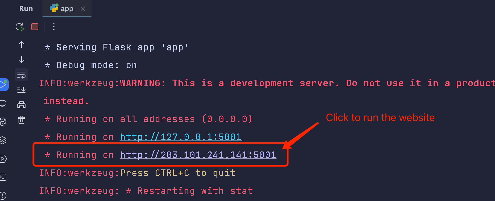
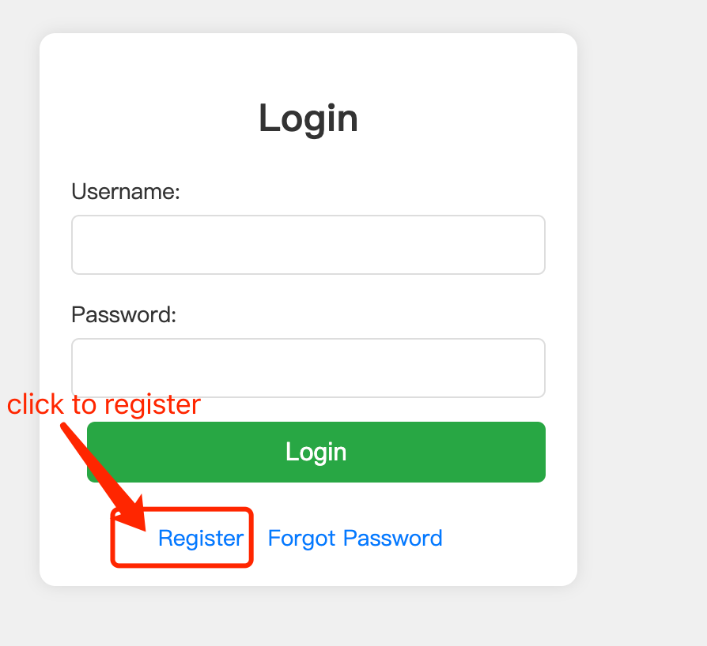
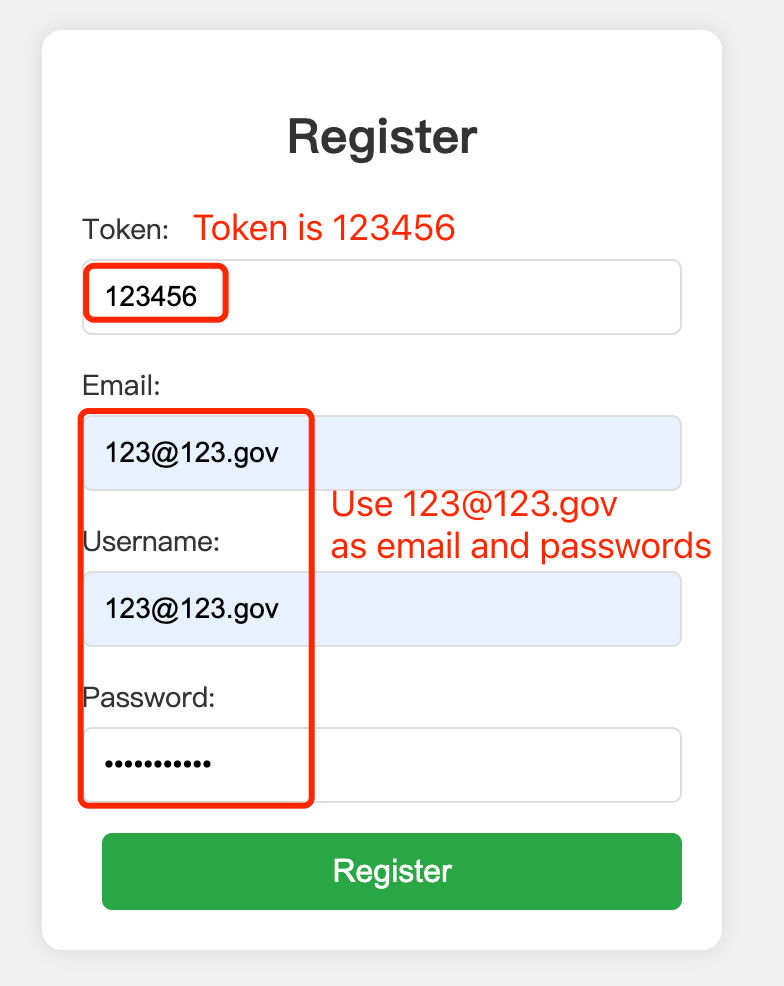
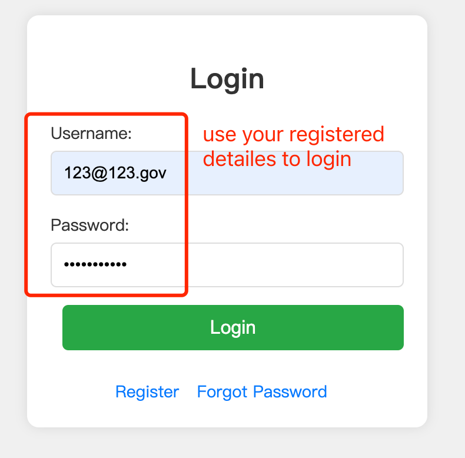
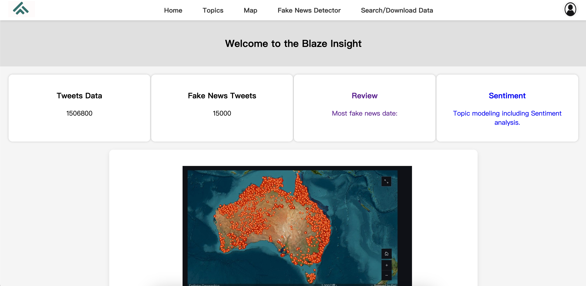

# DECO3801 Project 50T: Analyzing Misinformation on Twitter During the 2019-20 Australian Bushfires

## 1. Project Overview

### 1.1 Project Description
The 2019-20 Australian bushfires highlighted the vital role of social media platforms, particularly Twitter, in the dissemination of information and the expression of public sentiment. However, these platforms also became conduits for fake news and misinformation, which had the potential to exacerbate public anxiety and spread false narratives. This project is dedicated to analyzing nearly 500,000 tweets from this period to uncover genuine public reactions, identify key discussion topics, and assess the impact of misinformation.

Based on background research, the platform is specifically designed for media professionals, policymakers, and researchers who are keen to understand the public's response during this crisis. It focuses on identifying potential patterns of fake or misleading information by evaluating the credibility of shared content through methods such as detecting extreme sentiment scores, analyzing account statuses, and implementing fake news detection techniques. The findings will be presented via an interactive visual platform, enabling users to dynamically explore the data, grasp public sentiment, and recognize the role of misinformation during the bushfires. Ultimately, the platform aims to enhance users' understanding of public reactions during crises, inform media coverage and policy decisions, and strengthen the ability of researchers to critically evaluate misinformation.

### 1.2 Project Intent
This project endeavors to construct a rigorous analytical framework that bridges the gap between complex data analysis and the critical needs of media professionals, policymakers, and academic researchers. Through the visualization of emotional responses and the application of advanced methodologies for detecting misinformation, the platform will facilitate a nuanced understanding of the dynamics of public sentiment and the dissemination of false information during the bushfires. The goal of this project is to render sophisticated analytical insights accessible to these expert audiences, thereby enhancing their ability to critically assess the role of misinformation in shaping public discourse during crises.

## 2. Getting Started

### 2.1 Clone the Repository

    git clone https://github.com/Joezhou1211/DECO3801_T50

### 2.2 Navigate to Project Directory

    cd DECO3801_T50

### 2.3 Create and Activate Virtual Environment

    Windows run: .\setup_virtual_env.ps1
    Mac Run:    
    chmod +x
    setup_virtual_env.sh ./setup_virtual_env.sh

### 2.4 Install Dependencies

    pip install -r requirements.txt
    
    If any installations fail, manually install the required package like: pip install flask==2.2.2

### 2.5 Install SpaCy Model

    python -m spacy download en_core_web_sm

### 2.6 Run the Application

    cd backend
    python app.py

After successfully running the application, navigate to the second website.



## 3. Register and Login

### 3.1 Navigate to the Login Page

After running the application, you will see the login page as shown below. If you don’t have an account, click on the "Register" link to create a new account.



### 3.2 Register a New User

To register, enter the required token (which is 123456), your email, username, and password as shown in the image below. Use the same email address (123@123.gov) as both the email and username for this demo.



### 3.3 Login

Once registered, use the login page to sign in with your new credentials and begin using the application.



### 3.4 Using the Application

Once logged in, you will see the main dashboard of the application, where key insights and data visualizations are provided, including the number of total tweets, fake news tweets, and sentiment analysis.



## 4. Features and Technologies

### 4.1 Features
This project incorporates several key features to analyze and visualize the public sentiment and misinformation during the 2019-20 Australian bushfires. Sentiment analysis is implemented using VADER and TextBlob to assess the emotional tone of tweets. Topic modeling is conducted using Latent Dirichlet Allocation (LDA) to identify the main topics of discussion during the crisis. To detect fake news, we employ a range of machine learning models, including Logistic Regression, Random Forest, XGBoost, SVM, LSTM, and BERT. Finally, the project includes interactive data visualizations powered by ElasticSearch, enabling real-time data querying and filtering to provide users with a dynamic exploration of the tweet data.

### 4.2 Tools/Technologies/Frameworks
The project leverages a variety of tools and technologies across different stages of data processing, analysis, and visualization. Data processing is handled using Pandas, NLTK, TextBlob, and VADER, while natural language processing (NLP) and machine learning tasks are performed using TF-IDF, Word2Vec, BERT, Scikit-learn, TensorFlow, and Keras. For data visualization, the project utilizes D3.js, Chart.js, Plotly.js, Leaflet, and Mapbox. UX design is informed by research through Google Scholar and user interviews, with UI design executed using Sketch, Miro, and Figma. The backend infrastructure is built with Flask and ElasticSearch, while the frontend is developed using Vue.js, along with CSS, HTML, and JavaScript.

## 4. Project Structure (Unfinished)

```plaintext
project_root/                                          
├── backend/
│   ├── notebooks/
│   │   ├── fake_news_model_final.ipynb
│   │   ├── LDA_modeling_main+sub.ipynb
│   │   ├── location_json.ipynb
│   │   ├── model_1.ipynb
│   │   ├── NMF_modeling.ipynb
│   │   ├── pattern_regonisation & sampling.ipynb
│   │   ├── preprocess+pre_LDA.ipynb
│   │   ├── sentiment.ipynb
│   │   └── tweets_chain.ipynb
│   ├── utils/
│   │   ├── CSV_to_Json.py
│   │   ├── LDA_wordcloud.png
│   │   ├── main_LDA_visualization.html
│   │   ├── map_page_data_outputer.ipynb
│   │   ├── pre_LDA_visualization.html
│   │   ├── Time_Series & Topic & Sentiment Analysis Graph.py
│   │   ├── time_squence_analysis.py
│   │   └── topic_page_data_outporter.ipynb
│   ├── app.py
│   ├── data_importer.py
│   ├── elasticsearch_service.py
│   ├── model_service.py
│   └── news_service.py
├── data/
│   ├── processed/
│   │   ├── daily_weighted_sentiment_vader.csv
│   │   ├── fake.csv
│   │   ├── fake_news_data.json
│   │   ├── final_data(filtered).json
│   │   ├── final_data(main_topic).csv
│   │   ├── final_data(old).csv
│   │   ├── final_data.csv
│   │   ├── final_data.json
│   │   ├── final_data_cleaned.csv
│   │   ├── hourly_weighted_sentiment_vader.csv
│   │   ├── location.json
│   │   ├── location_counts.json
│   │   ├── output.json
│   │   ├── topic_data(final).json
│   │   ├── topic_data(parent&child).csv
│   │   ├── topic_data.json
│   │   ├── topic_timeline.csv
│   │   ├── tweet_chain_optimized.json
│   │   ├── tweets_with_final_nmf_topics_final.csv
│   │   └── whole_data(parent&child).csv
│   └── raw/
│       ├── v_forest.bson
│       └── v_forest.csv
├── frontend/
│   ├── assets/
│   │   ├── fakenews.png
│   │   ├── index map1.png
│   │   ├── logo.png
│   │   ├── map.png
│   │   ├── misleading1.png
│   │   ├── model1.png
│   │   ├── model2.png
│   │   ├── search-file.png
│   │   ├── Single Newwork Analysis.jpg
│   │   ├── statistics.png
│   │   ├── user.png
│   │   ├── user_icon.png
│   │   └── visible.png
│   ├── css/
│   │   ├── contact.css
│   │   ├── fakeNews.css
│   │   ├── help.css
│   │   ├── index.css
│   │   ├── logIn.css
│   │   ├── map.css
│   │   ├── search.css
│   │   ├── setting.css
│   │   ├── style.css
│   │   └── topics.css
│   ├── js/
│   │   ├── contact.js
│   │   ├── fakeNews.js
│   │   ├── forgetpassword.js
│   │   ├── index.js
│   │   ├── logIn.js
│   │   ├── main.js
│   │   ├── map.js
│   │   ├── register.js
│   │   ├── search.js
│   │   ├── security.js
│   │   ├── setting.js
│   │   └── topics.js
│   └── pages/
│       ├── contact.html
│       ├── fakeNews.html
│       ├── forgetpassword.html
│       ├── help.html
│       ├── index.html
│       ├── logIn.html
│       ├── map.html
│       ├── register.html
│       ├── search.html
│       ├── security.html
│       ├── setting.html
│       └── topics.html
├── models/
│   ├── main_topics/
│   │   ├── corpus_subtopics
│   │   ├── corpus_subtopics.index
│   │   ├── dictionary_subtopics
│   │   ├── lda_model_subtopics
│   │   ├── lda_model_subtopics.expElogbeta.npy
│   │   ├── lda_model_subtopics.id2word
│   │   └── lda_model_subtopics.state
│   └── pre_topics/
│       ├── corpus.mm
│       ├── corpus.mm.index
│       ├── dictionary.gensim
│       ├── final_nmf_model.pkl
│       ├── lda_model.gensim
│       ├── lda_model.gensim.expElogbeta.npy
│       ├── lda_model.gensim.id2word
│       └── lda_model.gensim.state
├── UI/
│   ├── UI assets/
│   │   ├── Network Side Bar In.png
│   │   ├── Network Side Bar Out.png
│   │   ├── Topic Slider Bar In.png
│   │   ├── Topic Slider Bar Out.png
│   │   ├── Twitters.png
│   │   ├── map.png
│   │   ├── network.png
│   │   ├── network full version.png
│   │   ├── webframe 1.png
│   │   ├── webframe 2.png
│   │   └── webframe 3.png
│   └── UX assets/
│       ├── Deeply analysis of user group.png
│       ├── Further relational researchs.png
│       ├── Research and design reason.png
│       ├── Research of visualization.png
│       ├── Target audience mindmap.png
│       ├── Website Purpose& Fake news imapct.png
│       ├── site map.jpg
│       └── first version of LFI.jpg
├── .gitattributes
├── .gitignore
├── README.md
├── requirements.txt
├── setup_virtual_env.ps1
└── setup_virtual_env.sh
```

